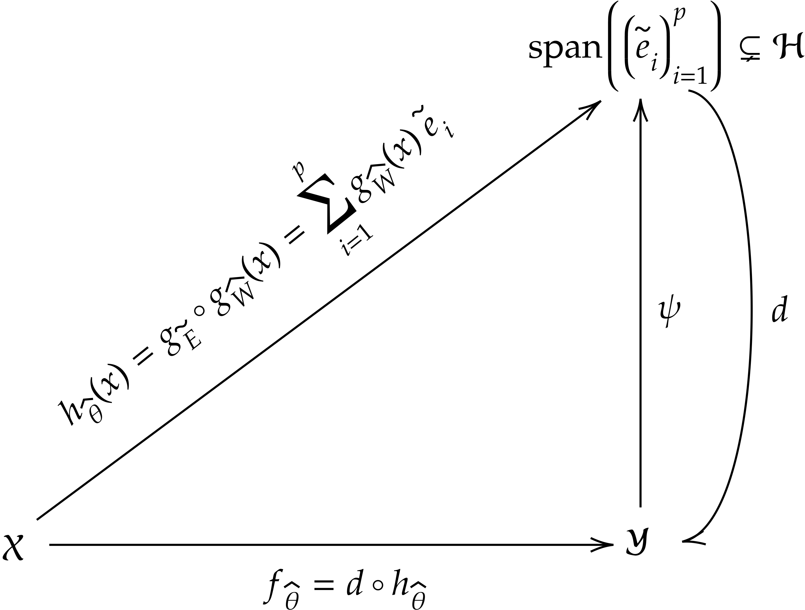
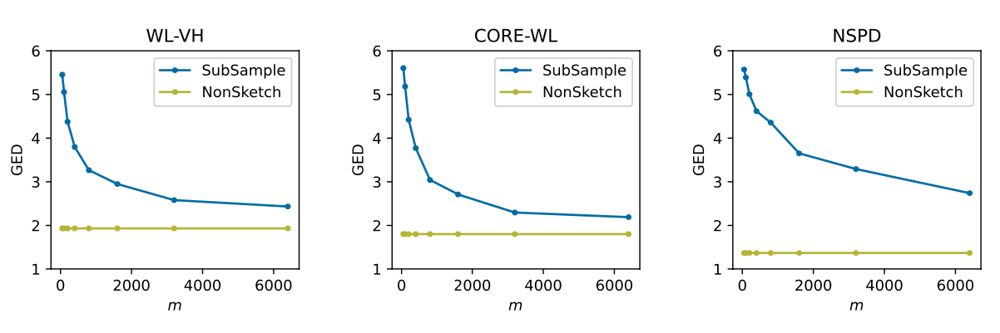

# Deep Sketched Output Kernel Regression for Structured Prediction

[](https://paperswithcode.com/sota/cross-modal-retrieval-on-chebi-20?p=deep-sketched-output-kernel-regression-for)

This Python package contains code to use kernel-induced losses with neural networks for Structured Prediction.



## Environment Preparation
```bash
conda create -n dsokr python=3.8
conda activate dsokr
conda install pytorch==2.2.0 pytorch-cuda=11.8 -c pytorch -c nvidia
pip install transformers==4.37.2 \
            grakel==0.1.10 \
            torchtext==0.17.0 \
            scikit-learn==1.3.0 \
            tqdm==4.65.0 \
            numpy==1.24.3 \
            matplotlib==3.7.2 \
            rdkit==2023.9.4 \
            chainer-chemistry==0.7.1
```

## Experiment: SMI2Mol
### 1) Dataset
In order to create the dataset SMI2Mol used in our paper, please run the following script:
```bash
python create_smi2mol.py
```
The resulting data files can be found in the `Data/smi2mol` directory.

### 2) Sketching size selection with *Perfect h*
To select the sketching size with the *Perfect h* strategy described in our paper, you can run the following line:
```bash
python s2m_dsokr_perfect_h.py --random_seed_split 1996
```
When the experiment ends, you obtain the following figure, which provides a clue about the sketching size to choose:



### 3) Training and testing
Run the following script to train the `dsokr` model and get the performance on the test set:
```bash
python s2m_dsokr.py --random_seed_split 1996 --output_kernel "CORE-WL" --mys_kernel 3200 --nlayers 6 --nhead 8 --dropout 0.2 --dim 256
```
Normally, you can get the results like this (the results and the checkpoints are saved in the directory `exper`):
```
Test mean edit distance: 2.9375
Test mean edit distance w/o edge feature: 1.9905
```

## Experiment: ChEBI-20
### 1) Dataset
Create the data directory:
```bash
mkdir Data/chebi-20/
```
Then you need to obtain the three data files `training.txt`, `val.txt` and `text.txt` from the following link: https://github.com/cnedwards/text2mol/tree/master/data. Put all these files into the directory `Data/chebi-20/`. Run the following script to pre-process data:
```bash
python create_ChEBI-20.py
```

### 2) Sketching size selection with *Perfect h*
To select the sketching size with the *Perfect h* strategy described in our paper, you can run the following script:
```bash
python chebi20_dsokr_perfect_h.py --save_dir "exper/chebi_20/" 
```
You will get Figure 5 in our paper.

### 3) Training and testing
Run the following script to train the `dsokr` model and get the performance on the test set:
```bash
python chebi20_dsokr.py --my 100 --output_sketch_name "SubSample" --output_kernel 'cosine' --save_dir "exper/chebi_20/" --random_seed 42
```
Normally, you can get the results like this (the results and the checkpoints can be found in the save directory):
```
Test mrr: 0.6226708200763317
Test top1: 0.48106634353226296
Test top10: 0.868524689488034
```

### 4) Ensemble
Repeat step 3) with different hyper-parameters, such as the output sketcher, random seed or even the output kernel type.

## Cite

If you use this code, please cite the corresponding work:

```bibtex
@misc{elahmad2024deep,
      title={Deep Sketched Output Kernel Regression for Structured Prediction}, 
      author={Tamim {El Ahmad} and Junjie Yang and Pierre Laforgue and Florence d'Alché-Buc},
      year={2024},
      eprint={2406.09253},
      archivePrefix={arXiv},
      primaryClass={id='stat.ML' full_name='Machine Learning' is_active=True alt_name=None in_archive='stat' is_general=False description='Covers machine learning papers (supervised, unsupervised, semi-supervised learning, graphical models, reinforcement learning, bandits, high dimensional inference, etc.) with a statistical or theoretical grounding'}
}
```

## Acknowledgments
Funded by the European Union. Views and opinions expressed are however those of the author(s) only and do not necessarily reflect those of the European Union or European Commission. Neither the European Union nor the granting authority can be held responsible for them. This project has received funding from the European Union’s Horizon Europe research and innovation programme under grant agreement 101120237 (ELIAS), the Télécom Paris research chair on Data Science and Artificial Intelligence for Digitalized Industry and Services (DSAIDIS) and the PEPR-IA through the project FOUNDRY.